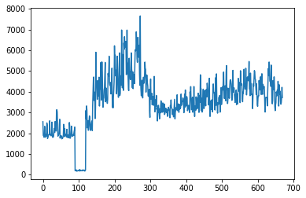
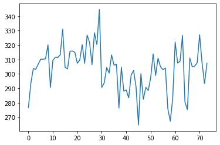

# DSAI Homework 1 Working Report

# Index
In this report we are going to cover:
- Execution
-	Data observation
-	Choosing validation dataset
-	Model experiment
-	Model bagging
-	Bonus
- Result

---

# Execution
```sh
python main.py --training training_data.csv --output submission.csv
```

---

# Data observation
We first download all the dataset that we can found in the link.
We totally found 3 datasets:
1.	Dataset 1: 201901-202010
2.	Dataset 2: 202001-202012
3.	Dataset 3: 202101-today
First, we plot out the reserve power data in Dataset 1.



We also plot out Dataset 2.


And Dataset 3.



As the plot shows, all 3 datasets have no seasonality features or any significant repeated data.
Since that, we cannot just randomly choose the validation data and train blindly. Therefore, choosing the proper validation data are important.
This will lead us to the next topic. How to choose the validation data.

---

# Choosing validation dataset
We describe the importance of choosing a proper validation dataset on the last chapter. In this Chapter, we are going to show you how we choose it. Why we choose it.
In this homework, our goal is to predict the reserve power on March 23-29. We think the reserve power might have something do with the season so we set up a range of time that we can consider as our validation data. Since March 23 is Tuesday, we look back the history, and choosing the data between 4th week of February to 1st week of April in every year. We have totally 16 validation datasets.


After we set up the range, we extract the data and divide them into weeks.
We plot out these data and we found out that these data have some sort of patterns.


When there is a pattern, there are always something that can predict.

---

# Model Experiment
We expect our output like this


## 1. ARIMA
After we decide our validation dataset, it is time to apply it to different models.
The idea is to try as many models as we can and choose the best model for this certain data.

We first choose the ARIMA model as our model base line. It is the most common use model when dealing with time series forecasting data. We run the test on each validation data with all the data before validation date as training dataset. On each experiment we use RMSE as our simple scoring benchmark.


As you can see, this might not be the perfect model for this dataset.
Although the model did not act as we expected, it still has its own reference value.

## 2. Prophet and Neural Prophet
Prophet is a model that develop by Facebook. It has a lot of feature and parameter that can suit any time series forecasting problem.
We conduct the same experiment as we do on ARIMA.


As you can see, neural prophet can achieve 5.7 RMSE score on the best condition.

## 3. LSTM
We also construct a simple LSTM model and conduct the same experiment as last 3 models.


We didn't use this model in the end because the prediction of this model is pretty much a straight line. It has large RMSE value and didn't make any sense in the real world.

---

# Model bagging
In this sector we totally have 3 models tested. At this point, we decide to use the bagging technique. We give each model's output a weight. For neural prophet and ARIMA we gave both 0.4 weight value. For prophet we only gave it 0.2 weight value. The reason is that prophet ARIMA and neural prophet prediction are more close to our validation data. As for prophet, the value of prediction are not stable.
```
Formula: prophet * 0.2 + neural_prophet * 0.4 + ARIMA * 0.4
```
---

# Bonus
We minus 200MW on the Thursday prediction value. The reason behind this action is because we observe that day(3/27) will have a large scale planned outage on different cities and it seems like a weekly event.
After our discussion, we decide to minus 200 MW on that day.

Source:

https://branch.taipower.com.tw/Content/NoticeBlackout/bulletin.aspx?&SiteID=564732646551216421&MmmID=616371300113254267
https://branch.taipower.com.tw/Content/NoticeBlackout/bulletin.aspx?&SiteID=564732646740712354&MmmID=616371300071172245#20210327
https://branch.taipower.com.tw/Content/NoticeBlackout/bulletin.aspx?&SiteID=564263330600005036&MmmID=564727707475741655

---

# [Result](./code/submission.csv)
